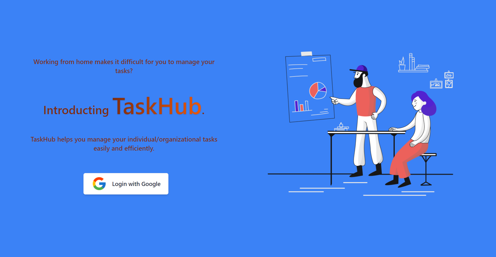
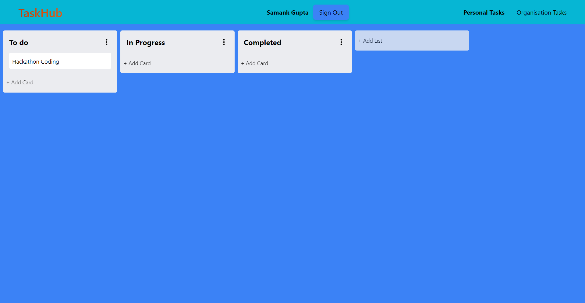
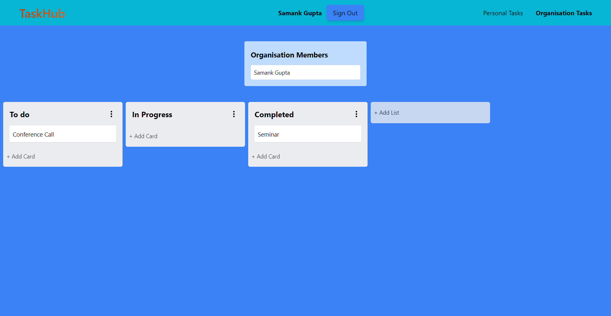

<h1 align="center">TaskHub 📝</h1>

    <a href="https://taskhubapp.netlify.app/">View Website</a>

TaskHub is a tool that helps you manage your individual/organizational tasks easily and efficiently.

## Technologies Used

## Features
TaskHub helps you manage your tasks efficiently. Login with your google account to start. Login and Authentication is handled by Supabase.

* [Personal Tasks](#personal-tasks)
* [Organisation Tasks](#organisation-tasks)

## Personal Tasks

 
A user can create seperate lists for their personal tasks. Some examples of lists include "To Do", "In Progress" and "Complete".
A user can add, delete, edit lists. In each list, users can add, delete, edit cards. They can also drag and drop lists, cards to sort them as per their choice.

## Organisation Tasks

 
When a user signs in, they are added to an organisation. Users can use this to manage tasks for a company, organisation, etc.
The lists and cards work in the same manner as personal tasks.